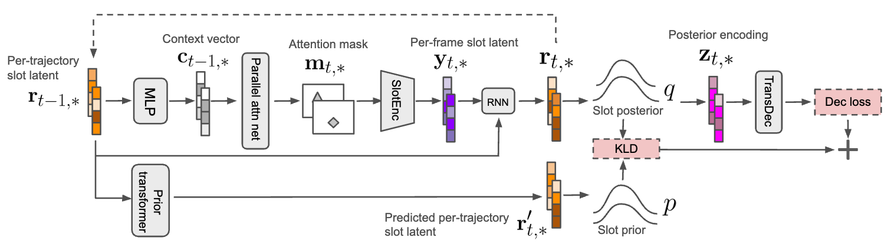
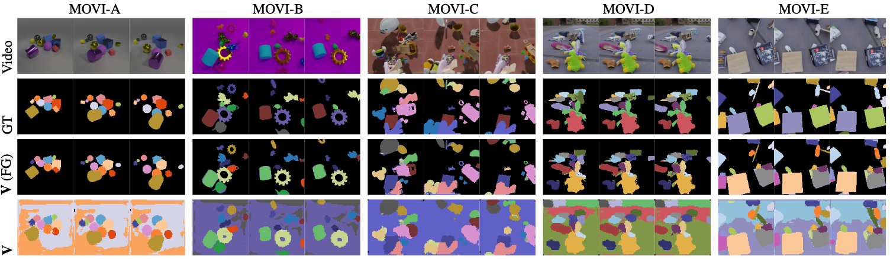
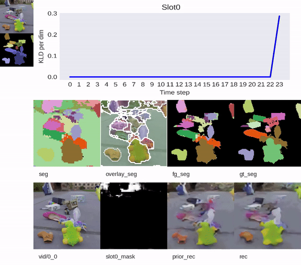

# VONet: Unsupervised Video Object Learning With Parallel U-Net Attention and Object-wise Sequential VAE

This repo releases the code for the paper

> VONet: Unsupervised Video Object Learning With Parallel U-Net Attention and Object-wise Sequential VAE, Yu and Xu, ICLR 2024.

## What is VONet?

VONet is an unsupervised video object learning method that decomposes a video scene
into structural object representations without any supervision from depth, optical flow,
or segmentation. VONet is also trained from scratch, without relying on pretrained visual
features.

VONet has two important features that make it different from prior works:
- While utilizing a U-Net architecture, VONet employs an efficient and effective parallel attention inference process, generating attention masks for
all slots simultaneously within a frame. This makes its inference time constant instead of linear regardless of
the increasing number of object slots.
- To enhance the temporal consistency of each object mask across consecutive video frames, VONet develops an object-wise sequential VAE framework.

Evaluated by two metrics FG-ARI and mIoU, VONet is the leading unsupervised method for object learning across five MOVI datasets, encompassing videos of diverse complexities.


#### VONet's architecture


#### Example results



## Installation

Our algorithm is based on [Agent Learning Framework (ALF)](https://github.com/HorizonRobotics/alf). Python3.7+ is currently supported by ALF and [Virtualenv](https://virtualenv.pypa.io/en/latest/) is recommended for the installation.

After activating a virtual env, download and install VONet:

```bash
git clone https://github.com/hnyu/vonet
cd vonet
# As of Jan 2024, ALF uses torch==1.11 which by default has cuda==10.2. For recent
# GPU cards (3090 and after), cuda>=11.3 is needed.
pip install -e . --extra-index-url https://download.pytorch.org/whl/cu113
# With an old GPU card, you might just do:
# pip install -e .
```

We tested the installation in Ubuntu20.04+CUDA11.4 with Nvidia 3090 GPUs.

## Docker

If by any chance the installation is not successful on your OS, you can use a
docker image built from this [docker file](docker/Dockerfile):

```bash
docker run --gpus all -it horizonrobotics/misc:vonet-train /bin/bash
```

It has already installed all dependencies for VONet.

## MOVI datasets preparation

The official MOVI datasets are hosted on `gs://kubric-public/tfds` (https://github.com/google-research/kubric/tree/main/challenges/movi). However, our [data processing pipeline](vonet/movi.py) assumes that
the MOVI datasets are stored locally. This is not necessary but it avoids network
connection issues that could happen occasionally and speeds up data loading.

We convert each video of MOVI-{A-E} to a pickle file using the script `scripts/download_movi_data.py`.
As an example, we have included a toy subset (10 training videos + 2 validation videos)
of MOVI-A [here](data/movi_a).

The dataset paths should be like `$MOVI_ROOT/movi_{a,b,c,d,e}/{train,validation}`,
and an environment variable `MOVI_ROOT` should point to the parent directory that
contains all the five datasets.

## Train VONet

For a test run,

```bash
cd vonet
MOVI_ROOT=$(pwd)/data python -m alf.bin.train --root_dir /tmp/vonet --conf vonet/confs/movi_a_exp_conf.py --conf_param="_CONFIG._USER.debug=1"
```

This will train VONet on the toy MOVI-A dataset in the debug mode, with much fewer GPU and CPU resources.

To launch the full training job, you can modify `MOVI_ROOT` pointing to the directory that
contains full MOVI datasets, and remove `--conf_param="_CONFIG._USER.debug=1"`. You also need ALF's multi-gpu training:

```bash
MOVI_ROOT=<YOUR_MOVI_ROOT> python -m alf.bin.train --root_dir /tmp/vonet --conf vonet/confs/movi_a_exp_conf.py --distributed multi-gpu
```

This will use all CUDA visible devices.

Warning: training a full job on any of the five datasets will require at least 4 Nvidia 3090 GPUs and 30G CPU memory. Please
see the Experiments section of the paper for more details.

## View training results

Launch the tensorboard

```bash
tensorboard --logdir /tmp/vonet
```

Under "SCALARS", you can check the FG-ARI and mIoU metric curves in the
"VONetAgent/rollout_fg_ari" and "VONetAgent/rollout_mIoU" tabs. (Note that the
metrics shown here are for *training* videos.)

Under "IMAGES", you can check soft attention masks in the "mask" tab, and
hard segmentation masks in the "seg" tab.

## Evaluation

To evaluate a trained model on evaluation videos:

```bash
MOVI_ROOT=<YOUR_MOVI_ROOT> python -m alf.bin.play --root_dir /tmp/vonet --num_episodes <num_eval_videos> --conf_param="_CONFIG._USER.test=1" --norender
```
Both FG-ARI and mIoU values will be output for each video in the format:

```bash
=> FG-ARI: xxxxxx, mIoU: xxxxxx
```

Also you can visualize the results into an mp4 video:

```bash
MOVI_ROOT=<YOUR_MOVI_ROOT> python -m alf.bin.play --root_dir /tmp/vonet --num_episodes <num_eval_videos> --conf_param="_CONFIG._USER.test=1" --record_file /tmp/eval.mp4 --alg_render
```

Visualization example:



## Issues
For any question, please open an issue in this repo.

## Citation
```
@inproceedings{Yu2024VONet,
    author={Haonan Yu and Wei Xu},
    title={VONet: Unsupervised Video Object Learning With Parallel U-Net Attention and Object-wise Sequential VAE},
    booktitle={ICLR},
    year={2024}
}
```